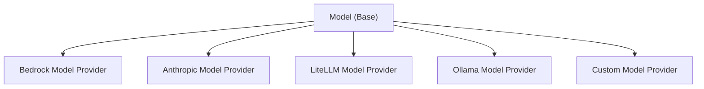

# Creating a Custom Model Provider

Strands Agents SDK provides an extensible interface for implementing custom model providers, allowing organizations to integrate their own LLM services while keeping implementation details private to their codebase.

## Model Provider Architecture

Strands Agents uses an abstract `Model` class that defines the standard interface all model providers must implement:



## Implementing a Custom Model Provider

### 1. Create Your Model Class

Create a new Python module in your private codebase that extends the Strands Agents `Model` class. In this case we also set up a `ModelConfig` to hold the configurations for invoking the model.

```python
# your_org/models/custom_model.py
import logging
import os
from typing import Any, Iterable, Optional, TypedDict
from typing_extensions import Unpack

from custom.model import CustomModelClient

from strands.types.models import Model
from strands.types.content import Messages
from strands.types.streaming import StreamEvent
from strands.types.tools import ToolSpec

logger = logging.getLogger(__name__)


class CustomModel(Model):
    """Your custom model provider implementation."""

    class ModelConfig(TypedDict):
        """
        Configuration your model.

        Attributes:
            model_id: ID of Custom model.
            params: Model parameters (e.g., max_tokens).
        """
        model_id: str
        params: Optional[dict[str, Any]]
        # Add any additional configuration parameters specific to your model

    def __init__(
        self,
        api_key: str,
        *,
        **model_config: Unpack[ModelConfig]
    ) -> None:
        """Initialize provider instance.

        Args:
            api_key: The API key for connecting to your Custom model.
            **model_config: Configuration options for Custom model.
        """
        self.config = CustomModel.ModelConfig(**model_config)
        logger.debug("config=<%s> | initializing", self.config)

        self.client = CustomModelClient(api_key)

    @override
    def update_config(self, **model_config: Unpack[ModelConfig]) -> None:
        """Update the Custom model configuration with the provided arguments.

        Can be invoked by tools to dynamically alter the model state for subsequent invocations by the agent.

        Args:
            **model_config: Configuration overrides.
        """
        self.config.update(model_config)


    @override
    def get_config(self) -> ModelConfig:
        """Get the Custom model configuration.

        Returns:
            The Custom model configuration.
        """
        return self.config

```

### 2. Implement `format_request`

Map the request parameters provided by Strands Agents to your Model Providers request shape:

- [`Messages`](../../../api-reference/types.md#strands.types.content.Messages): A list of Strands Agents messages, containing a [Role](../../../api-reference/types.md#strands.types.content.Role) and a list of [ContentBlocks](../../../api-reference/types.md#strands.types.content.ContentBlock).
  - This type is modeled after the [BedrockAPI](https://docs.aws.amazon.com/bedrock/latest/APIReference/API_runtime_Message.html).
- [`list[ToolSpec]`](../../../api-reference/types.md#strands.types.tools.ToolSpec): List of tool specifications that the model can decide to use.
- `SystemPrompt`: A system prompt string given to the Model to prompt it how to answer the user.

```python
    @override
    def format_request(
        self, messages: Messages, tool_specs: Optional[list[ToolSpec]] = None, system_prompt: Optional[str] = None
    ) -> dict[str, Any]:
        """Format a Custom model request.

        Args: ...

        Returns: Formatted Messages array, ToolSpecs, SystemPrompt, and additional ModelConfigs.
        """
        return {
            "messages": messages,
            "tools": tool_specs,
            "system_prompt": system_prompt,
            **self.config, # Unpack the remaining configurations needed to invoke the model
        }

```


### 3. Implement `format_chunk`:

Convert the event(s) returned by your model to the Strands Agents [StreamEvent](../../../api-reference/types.md#strands.types.streaming.StreamEvent) type (modeled after the [Bedrock API](https://docs.aws.amazon.com/bedrock/latest/APIReference/API_Types_Amazon_Bedrock_Runtime.html)). The [StreamEvent](../../../api-reference/types.md#strands.types.streaming.StreamEvent) type is a dictionary that expects to have a single key, and whose value corresponds to one of the below types:

* [`messageStart`](../../../api-reference/types.md#strands.types.streaming.MessageStartEvent): Event signaling the start of a message in a streaming response. This should have the `role`: `assistant`
```python
{
    "messageStart": {
        "role": "assistant"
    }
}
```
* [`contentBlockStart`](../../../api-reference/types.md#strands.types.streaming.ContentBlockStartEvent): Event signaling the start of a content block. If this is the first event of a tool use request, then set the `toolUse` key to have the value [ContentBlockStartToolUse](../../../api-reference/types.md#strands.types.content.ContentBlockStartToolUse)
```python
{
    "contentBlockStart": {
        "start": {
            "name": "someToolName", # Only include name and toolUseId if this is the start of a ToolUseContentBlock
            "toolUseId": "uniqueToolUseId"
        }
    }
}
```
* [`contentBlockDelta`](../../../api-reference/types.md#strands.types.streaming.ContentBlockDeltaEvent): Event continuing a content block. This event can be sent several times, and each piece of content will be appended to the previously sent content.
```python
{
    "contentBlockDelta": {
        "delta": { # Only include one of the following keys in each event
            "text": "Some text", # String repsonse from a model
            "reasoningContent": { # Dictionary representing the reasoning of a model.
                "redactedContent": b"Some encryped bytes",
                "signature": "verification token",
                "text": "Some reasoning text"
            },
            "toolUse": { # Dictionary representing a toolUse request. This is a partial json string.
                "input": "Partial json serialized repsonse"
            }
        }
    }
}
```
* [`contentBlockStop`](../../../api-reference/types.md#strands.types.streaming.ContentBlockStopEvent): Event marking the end of a content block. Once this event is sent, all previous events between the previous [ContentBlockStartEvent](../../../api-reference/types.md#strands.types.streaming.ContentBlockStartEvent) and this one can be combined to create a [ContentBlock](../../../api-reference/types.md#strands.types.content.ContentBlock)
```python
{
    "contentBlockStop": {}
}
```
* [`messageStop`](../../../api-reference/types.md#strands.types.streaming.MessageStopEvent): Event marking the end of a streamed response, and the [StopReason](../../../api-reference/types.md#strands.types.event_loop.StopReason). No more content block events are expected after this event is returned.
```python
{
    "messageStop": {
        "stopReason": "end_turn"
    }
}
```
* [`metadata`](../../../api-reference/types.md#strands.types.streaming.MetadataEvent): Event representing the metadata of the response. This contains the input, output, and total token count, along with the latency of the request.
```python
{
    "metrics" {
        "latencyMs": 123 # Latency of the model request in milliseconds.
    },
    "usage": {
        "inputTokens": 234, # Number of tokens sent in the request to the model..
        "outputTokens": 234, # Number of tokens that the model generated for the request.
        "totalTokens": 468 # Total number of tokens (input + output).
    }
}
```
* [`redactContent`](../../../api-reference/types.md#strands.types.streaming.RedactContentEvent): Event that is used to redact the users input message, or the generated response of a model. This is useful for redacting content if a guardrail gets triggered.
```python
{
    "redactContent": {
        "redactUserContentMessage": "User input Redacted",
        "redactAssistantContentMessage": "Assitant output Redacted"
    }
}
```


```python
    @override
    def format_chunk(self, event: Any) -> StreamEvent:
        """Format the Custom model response event into Strands Agents stream event.

        Args:
            event: Custom model response event.

        Returns: Formatted chunks.
        """
        return {...}
```

### 4. Invoke your Model

Now that you have mapped the Strands Agents input to your models request, use this request to invoke your model. If your model does not follow the above EventStream sequence by default, you may need to yield additional events, or omit events that don't map to the Strands Agents SDK EventStream type. Be sure to map any of your model's exceptions to one of Strands Agents' expected exceptions:

- [`ContextWindowOverflowException`](../../../api-reference/types.md#strands.types.exceptions.ContextWindowOverflowException): This exception is raised when the input to a model exceeds the maximum context window size that the model can handle. This will trigger the Strands Agents SDK's [`ConversationManager.reduce_context`](../../../api-reference/agent.md#strands.agent.conversation_manager.conversation_manager.ConversationManager.reduce_context) function.

```python
    @override
    def stream(self, request: Any) -> Iterable[Any]:
        """Send the request to the Custom model and get the streaming response.

        The items returned from this Iterable will each be formatted with `format_chunk` (automatically), then sent
        through the Strands Agents SDK.

        Args:
            request: Custom model formatted request.

        Returns:
            Custom model events.
        """

        # Invoke your model with the response from your format_request implemented above
        try:
            response = self.client(**request)
        except OverflowException as e:
            raise ContextWindowOverflowException() from e

        # This model provider does not have return an event that maps to MessageStart, so we create and yield it here.
        yield {
            "messageStart": {
                "role": "assistant"
            }
        }

        # The rest of these events are mapped in the format_chunk method above.
        for chunk in response["stream"]:
            yield chunk
```

### 5. Use Your Custom Model Provider

Once implemented, you can use your custom model provider in your applications:

```python
from strands import Agent
from your_org.models.custom_model import Model as CustomModel

# Initialize your custom model provider
custom_model = CustomModel(
    api_key="your-api-key",
    model_id="your-model-id",
    params={
        "max_tokens": 2000,
        "temperature": 0.7,

    },
)

# Create a Strands agent using your model
agent = Agent(model=custom_model)

# Use the agent as usual
response = agent("Hello, how are you today?")
```

## Key Implementation Considerations

### 1. Message Formatting

Strands Agents' internal `Message`, `ToolSpec`, and `SystemPrompt` types must be converted to your model API's expected format:

- Strands Agents uses a structured message format with role and content fields
- Your model API might expect a different structure
- Map the message content appropriately in `format_request()`

### 2. Streaming Response Handling

Strands Agents expects streaming responses to be formatted according to its `StreamEvent` protocol:

- `messageStart`: Indicates the start of a response message
- `contentBlockStart`: Indicates the start of a content block
- `contentBlockDelta`: Contains incremental content updates
- `contentBlockStop`: Indicates the end of a content block
- `messageStop`: Indicates the end of the response message with a stop reason
- `metadata`: Indicates information about the response like input_token count, output_token count, and latency
- `redactContent`: Used to redact either the users input, or the model's response
  - Useful when a guardrail is triggered

Your `format_chunk()` method must transform your API's streaming format to match these expectations.

### 3. Tool Support

If your model API supports tools or function calling:

- Format tool specifications appropriately in `format_request()`
- Handle tool-related events in `format_chunk()`
- Ensure proper message formatting for tool calls and results

### 4. Error Handling

Implement robust error handling for API communication:

- Context window overflows
- Connection errors
- Authentication failures
- Rate limits and quotas
- Malformed responses

### 5. Configuration Management

The build in `get_config` and `update_config` methods allow for the model's configuration to be changed at runtime.

- `get_config` exposes the current model config
- `update_config` allows for at-runtime updates to the model config
  - For example, changing model_id with a tool call

## Structured Output Support

Structured output allows agents to receive type-safe, validated responses using [Pydantic](https://docs.pydantic.dev/latest/concepts/models/) models instead of raw text. When implementing a custom model provider, you need to ensure your provider can handle structured output requests properly.

### How Structured Output Works

When an agent calls [`Agent.structured_output()`](../../../api-reference/agent.md#strands.agent.agent.Agent.structured_output), the Strands SDK:

1. Converts the Pydantic model to a tool specification
2. Passes the tool specification to your model provider via the `tool_specs` parameter
3. Expects the model to respond with a tool call that matches the schema
4. Validates and returns the structured response

### Implementation Requirements

For your custom model provider to support structured output, ensure your implementation handles:

#### 1. Tool Specification Processing

Your `format_request()` method receives tool specifications that represent Pydantic models:

```python
@override
def format_request(
    self, messages: Messages, tool_specs: Optional[list[ToolSpec]] = None, system_prompt: Optional[str] = None
) -> dict[str, Any]:
    """Format a Custom model request with structured output support."""
    
    # Convert Strands tool specs to your model's format
    formatted_tools = None
    if tool_specs:
        formatted_tools = []
        for tool_spec in tool_specs:
            # Map ToolSpec to your model's tool format
            formatted_tool = {
                "name": tool_spec["name"],
                "description": tool_spec["description"],
                "input_schema": tool_spec["input_schema"]
            }
            formatted_tools.append(formatted_tool)
    
    return {
        "messages": messages,
        "tools": formatted_tools,  # Include tools in your request
        "system_prompt": system_prompt,
        **self.config,
    }
```

#### 2. Tool Call Response Handling

Your `format_chunk()` method must handle tool call responses properly:

```python
@override
def format_chunk(self, event: Any) -> StreamEvent:
    """Format model response events, including tool calls for structured output."""
    
    # Handle different event types from your model
    if event["type"] == "tool_call_start":
        return {
            "contentBlockStart": {
                "start": {
                    "toolUse": {
                        "name": event["tool_name"],
                        "toolUseId": event["tool_call_id"]
                    }
                }
            }
        }
    
    elif event["type"] == "tool_call_delta":
        return {
            "contentBlockDelta": {
                "delta": {
                    "toolUse": {
                        "input": event["partial_input"]  # Partial JSON string
                    }
                }
            }
        }
    
    elif event["type"] == "tool_call_end":
        return {
            "contentBlockStop": {}
        }
    
    # Handle other event types...
    return {...}
```

### Example Implementation

Here's a complete example showing structured output support in a custom model provider:

```python
from typing import Any, Iterable, Optional, TypedDict
from typing_extensions import Unpack
from pydantic import BaseModel

from strands.types.models import Model
from strands.types.content import Messages
from strands.types.streaming import StreamEvent
from strands.types.tools import ToolSpec

class PersonInfo(BaseModel):
    """Example Pydantic model for structured output."""
    name: str
    age: int
    occupation: str

class CustomModel(Model):
    # ... (previous implementation) ...
    
    @override
    def format_request(
        self, messages: Messages, tool_specs: Optional[list[ToolSpec]] = None, system_prompt: Optional[str] = None
    ) -> dict[str, Any]:
        """Format request with structured output support."""
        request = {
            "messages": self._format_messages(messages),
            "system_prompt": system_prompt,
            **self.config,
        }
        
        # Add tools if provided (for structured output)
        if tool_specs:
            request["tools"] = [
                {
                    "name": spec["name"],
                    "description": spec["description"],
                    "input_schema": spec["input_schema"]
                }
                for spec in tool_specs
            ]
        
        return request
    
    @override
    def format_chunk(self, event: Any) -> StreamEvent:
        """Format response events including tool calls."""
        event_type = event.get("type")
        
        if event_type == "message_start":
            return {"messageStart": {"role": "assistant"}}
        
        elif event_type == "content_block_start":
            if event.get("content_block", {}).get("type") == "tool_use":
                return {
                    "contentBlockStart": {
                        "start": {
                            "toolUse": {
                                "name": event["content_block"]["name"],
                                "toolUseId": event["content_block"]["id"]
                            }
                        }
                    }
                }
            else:
                return {"contentBlockStart": {"start": {}}}
        
        elif event_type == "content_block_delta":
            delta = event.get("delta", {})
            if delta.get("type") == "tool_use":
                return {
                    "contentBlockDelta": {
                        "delta": {
                            "toolUse": {
                                "input": delta.get("partial_json", "")
                            }
                        }
                    }
                }
            else:
                return {
                    "contentBlockDelta": {
                        "delta": {
                            "text": delta.get("text", "")
                        }
                    }
                }
        
        elif event_type == "content_block_stop":
            return {"contentBlockStop": {}}
        
        elif event_type == "message_stop":
            return {"messageStop": {"stopReason": event.get("stop_reason", "end_turn")}}
        
        # Handle other events...
        return {}

# Usage example
custom_model = CustomModel(
    api_key="your-api-key",
    model_id="your-model-id"
)

agent = Agent(model=custom_model)

# Use structured output
result = agent.structured_output(
    PersonInfo,
    "Extract information: John Smith is a 30-year-old software engineer"
)

print(f"Name: {result.name}")      # "John Smith"
print(f"Age: {result.age}")        # 30
print(f"Job: {result.occupation}") # "software engineer"
```

### Testing Structured Output

Test your structured output implementation:

```python
def test_structured_output():
    """Test structured output with your custom model."""
    from pydantic import BaseModel
    from strands import Agent
    
    class TestModel(BaseModel):
        field1: str
        field2: int
    
    agent = Agent(model=your_custom_model)
    
    try:
        result = agent.structured_output(
            TestModel,
            "Generate test data with field1 as 'test' and field2 as 42"
        )
        assert result.field1 == "test"
        assert result.field2 == 42
        print("Structured output test passed!")
    except Exception as e:
        print(f"Structured output test failed: {e}")

test_structured_output()
```

### Provider-Specific Considerations

When implementing structured output support:

1. **Tool Call Format**: Ensure your model's tool calling format matches what Strands expects
2. **JSON Schema**: Your model should understand and respect JSON schema constraints
3. **Streaming**: Handle partial tool call responses properly in streaming mode
4. **Error Handling**: Gracefully handle malformed tool calls or schema violations
5. **Model Capabilities**: Not all models support tool calling - document limitations clearly

### Troubleshooting

Common issues when implementing structured output:

- **Tool calls not recognized**: Check that your `format_request()` properly converts `ToolSpec` objects
- **Invalid JSON responses**: Ensure your model generates valid JSON that matches the schema
- **Streaming issues**: Verify that partial tool call responses are handled correctly
- **Schema validation errors**: Make sure your model respects the provided JSON schema constraints

For more information about structured output usage, see the [Structured Output documentation](../../agents/structured-output.md) and [examples](../../../../examples/python/structured_output.md).
